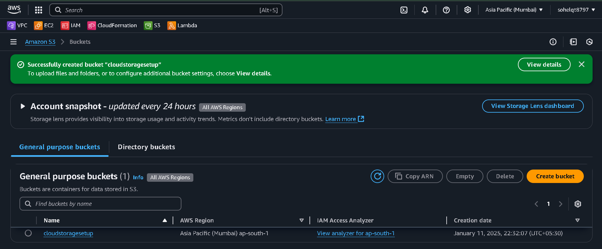
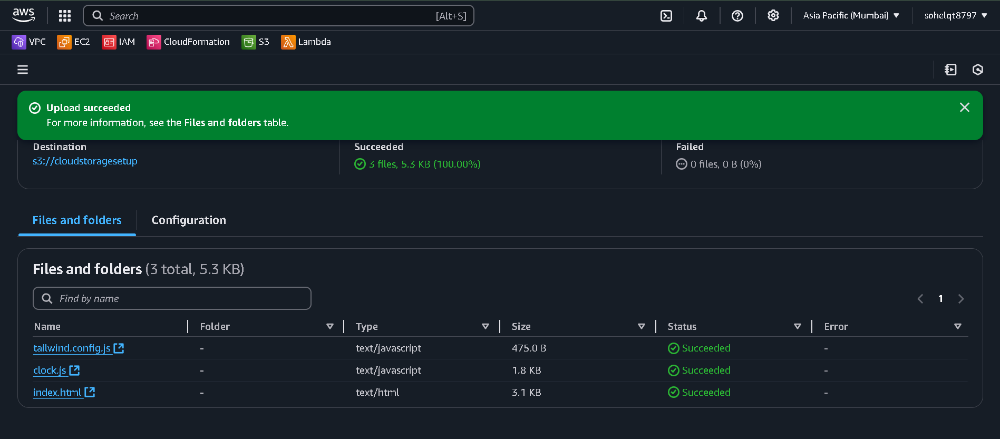
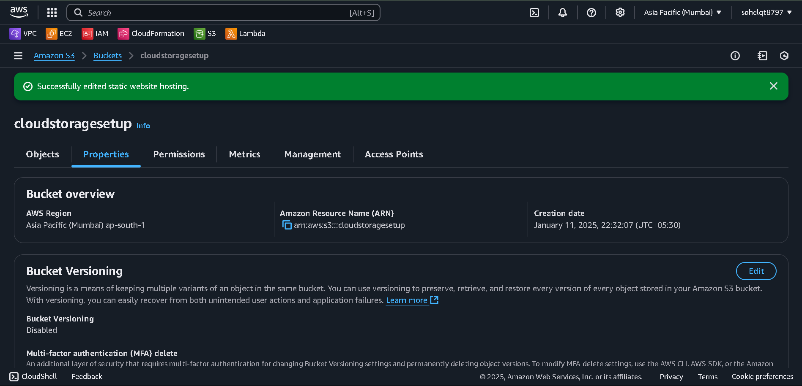
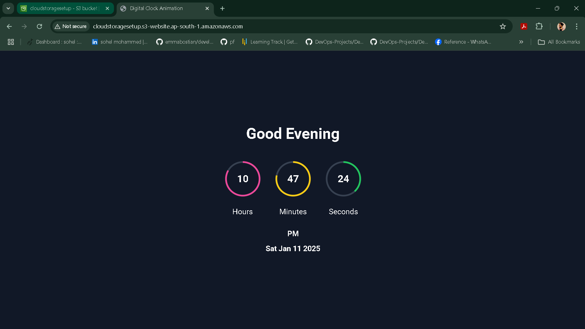

# **Amazon S3 Static Website Hosting**

This project demonstrates how to host a static website on Amazon S3 with public accessibility. Follow the detailed steps below to set up your static website, including advanced configurations for security and logging.

---

## **Table of Contents**
1. [Prerequisites](#prerequisites)
2. [Create an S3 Bucket](#create-an-s3-bucket)
3. [Upload Website Files](#upload-website-files)
4. [Enable Static Website Hosting](#enable-static-website-hosting)
5. [Configure Public Access](#configure-public-access)
6. [Access Your Website](#access-your-website)
7. [Advanced Task: Enable Logging](#advanced-task-enable-logging)
8. [Security Best Practices](#security-best-practices)

---

## **Prerequisites**
Before starting, ensure the following:
- [AWS account](https://aws.amazon.com/).
- Basic knowledge of the AWS Management Console.
- Optional: AWS CLI installed and configured for command-line operations.

---

## **1. Create an S3 Bucket**

1. Log in to the [AWS Management Console](https://aws.amazon.com/console/).
2. Navigate to the **S3** service.
3. Click **Create bucket**.
4. Enter a unique **Bucket name** (e.g., `my-static-site`).
5. Select your preferred **AWS Region**.
6. Leave the default settings or modify as required.
7. Click **Create bucket**.



---

## **2. Upload Website Files**

1. Open your bucket in the S3 dashboard.
2. Click **Upload** and add your `index.html` and `error.html` files.
3. During upload, ensure public access by granting **read permissions**.
4. Click **Upload** to finalize.



---

## **3. Enable Static Website Hosting**

1. Open the **Properties** tab of the bucket.
2. Scroll to **Static website hosting** and click **Edit**.
3. Select **Enable**.
4. Enter:
   - `index.html` as the **Index document**.
   - `error.html` as the **Error document**.
5. Save the changes.



---

## **4. Configure Public Access**

### **4.1 Update Bucket Policy**
1. Go to the **Permissions** tab.
2. Scroll to the **Bucket Policy** section and click **Edit**.
3. Add this JSON policy:
   ```json
   {
       "Version": "2012-10-17",
       "Statement": [
           {
               "Effect": "Allow",
               "Principal": "*",
               "Action": "s3:GetObject",
               "Resource": "arn:aws:s3:::cloudstoragesetup/*"
           }
       ]
   }

---




# Best Practices for Security

**Avoid Sensitive Data:**
- Do not store confidential data in your public bucket.

**Use Logging:**
- Enable server access logging to monitor access requests.

**Restrict Permissions:**
- Use the minimum permissions required (e.g., s3:GetObject for public buckets).

**Use Pre-Signed URLs:**
- For sensitive files, use pre-signed URLs to grant temporary access.

**Monitor Usage:**
- Use tools like AWS CloudTrail or Amazon S3 Access Logs to track activity.

